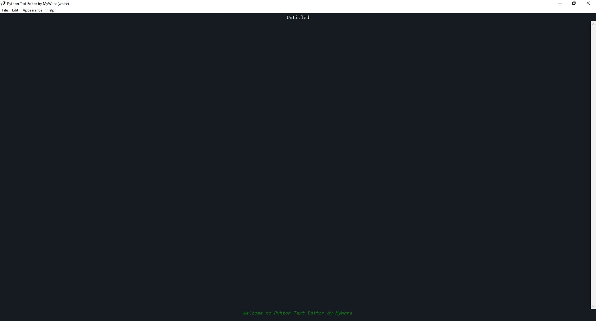
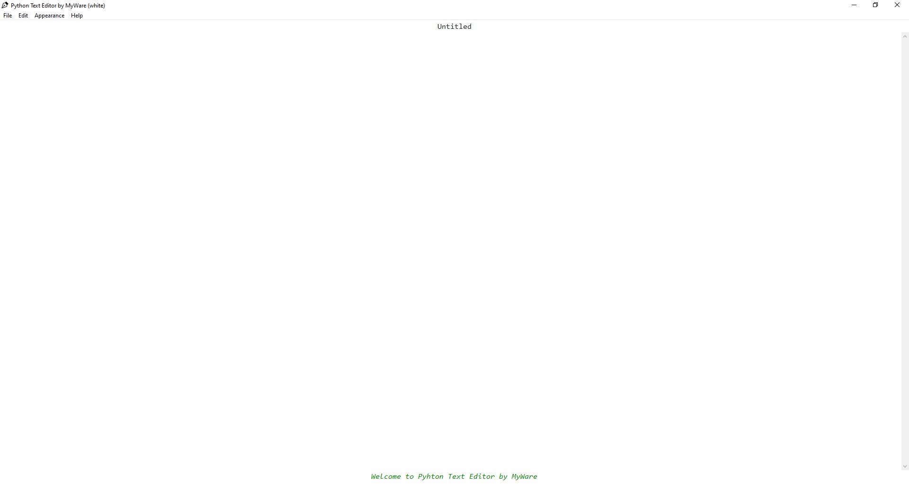

# python_text_editor

A simple and hackable text editor made by me with Python.

🐍 🖋️ ✍️

 

Contents
----------------

- <a href="https://github.com/MyWare386/python_text_editor#contents">Installation</a>
  - <a href="https://github.com/MyWare386/python_text_editor#executable">Executable</a>
  - <a href="https://github.com/MyWare386/python_text_editor#python">Python</a>
  - <a href="https://github.com/MyWare386/python_text_editor#other">Other</a>
- <a href="https://github.com/MyWare386/python_text_editor#dark-mode">Dark Mode</a>
- <a href="https://github.com/MyWare386/python_text_editor#white-mode">White Mode</a>
- <a href="https://github.com/MyWare386/python_text_editor#gallery">Gallery</a>
- <a href="https://github.com/MyWare386/python_text_editor#web">Web</a>
- <a href="https://github.com/MyWare386/python_text_editor#credits">Credits</a>

 

Installation
----------------

| ⚠️ Maybe, you will need to change the directory for the editor's icon ⚠️
|---

- <h3>Executable</h3>

Go to the exe directory.

Choose the theme that you want : dark or white.

Download and unzip the "texteditor_[your-color]_exe.zip".

Launch the "texteditor_[your-color].exe".

 

- <h3>Python</h3>

| ⚠️ Python must be installed on your computer
|---

Choose the theme that you want : dark or white.

Write this line in the command prompt :

<code>py \pathto\texteditor_[your-color].py</code>

 

- <h3>Other</h3>

Some code editor let you execute python files directly.

Or you can run the compiled pyhton file (.pyc).

 

Dark Mode
----------------

To use the dark mode, you must choose "texteditor_dark.exe/.py" when you install the editor.

 

White Mode
----------------

To use the dark mode, you must choose "texteditor_white.exe/.py" when you install the editor.

 

Gallery
-----------------

Here are some pictures of the editor :

- Dark Mode : 

- White Mode : 

- Logo (black) : 

- Logo (white) : 

 

Web
-------------------------------

The website of the project : https://myware386.github.io/python_text_editor/

 

Credits
--------------------------------

Project made by <a href="https://myware386.github.io/myware-website/">MyWare</a>.

Inspired by a tutorial.
